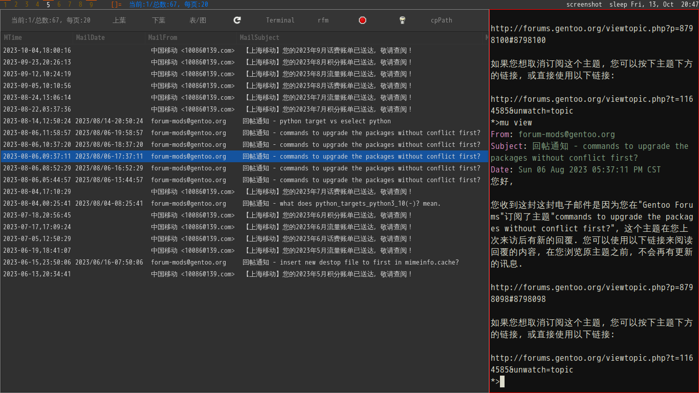
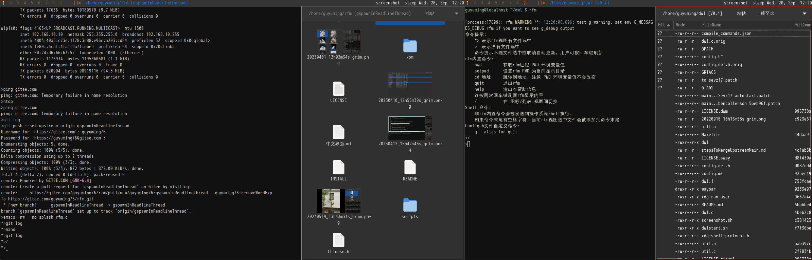
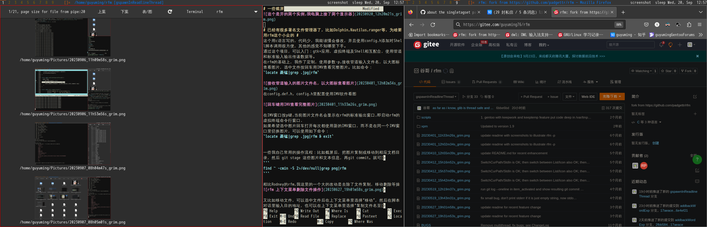
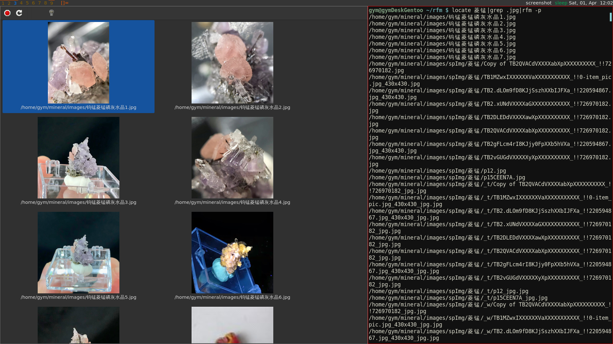
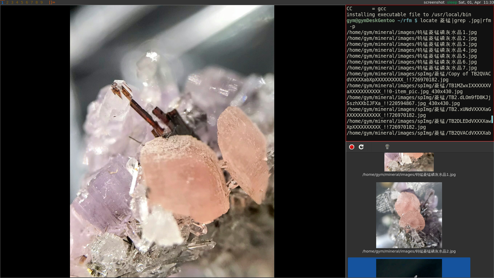
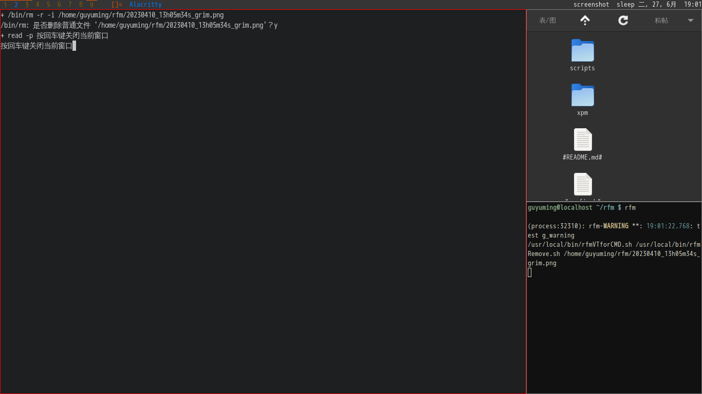
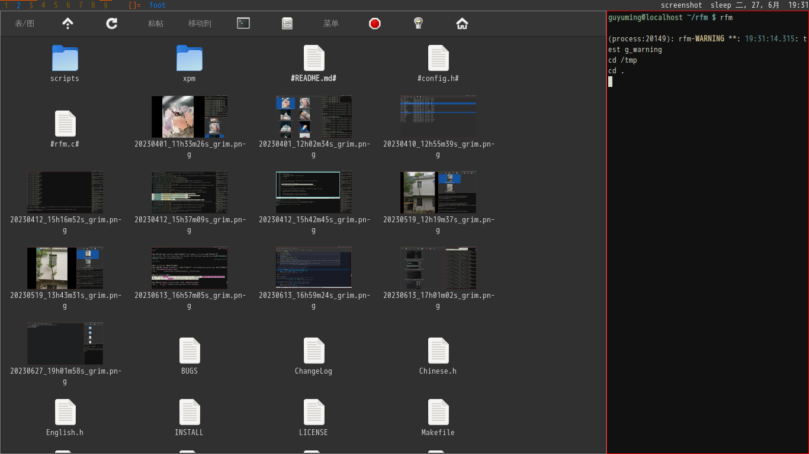
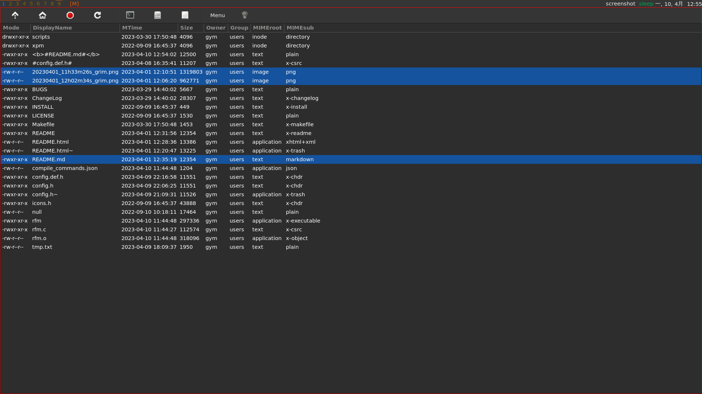
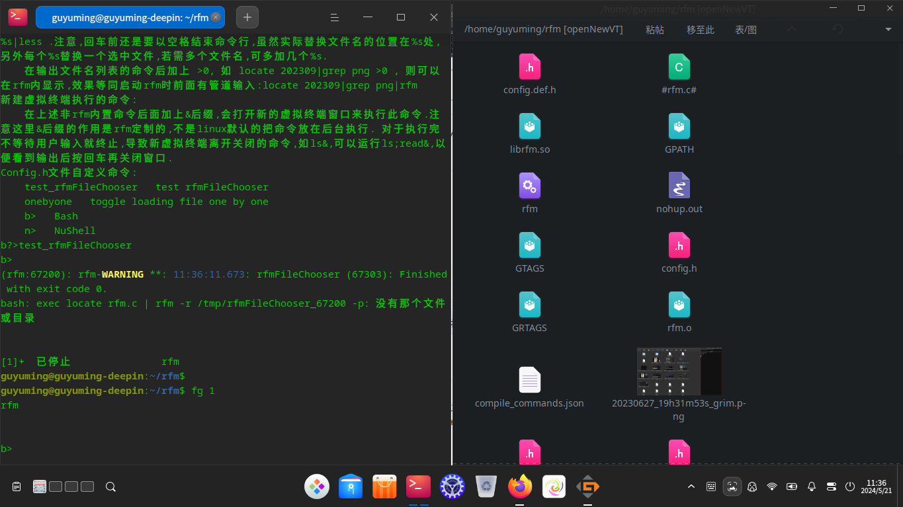

## 更新20240524 ##
除了使用执行文件rfm启动外,推荐使用脚本rfm.sh启动,脚本会识别当前终端模拟器,并设置环境变量$RFM_TERM, 在需要启动新终端模拟器实例时使这个变量. 也可以在系统环境设置默认环境变量值.

# 视频链接 #
https://www.bilibili.com/video/BV1vM411d7pu/?share_source=copy_web&vd_source=69ac2f08a55f7029fc7026bcf6b55e11

# 一些截屏 #

## 更新20240512 ##


## 更新20231023 ##

命令行:
`find /home/guyuming/Mail/ -mtime -365 -type f -not -path '*/.*'|xargs ls -w1 -t|rfm -l -s,5,19,20,21,22,23,`

## 更新20230920 ##






# 已经有很多著名文件管理器了，比如Dolphin,Nautilus,ranger等，为啥要用rfm这个小众的 #

这个用c语言写的，代码少，我能读懂会修改，并且使用config.h添加对Shell脚本调用很方便，其他的感觉不知哪里下手。

我是通过这个项目，实际入门的gtk+应用开发，虚拟终端及Shell相互配合，使用管道和标准输入输出传递数据等技术点。

在rfm的基础上，我作了定制，接收管道输入的文件名列表，以大图标查看图片，选中文件按回车用IMV查看完整图片。比如命令：

`locate 菱锰|grep .jpg|rfm`



这个是我拿到rfm后做的第一个功能增强,因为我当时需要一个工具来查看locate 命令返回的图片. 我不是很确定别的文件管理器有没有类似功能,考虑到研究尝试linux下现有文件管理器也费时间,即使找到有功能的,代码又不一定易读,所以就直接在rfm上动手了. 这个功能实现后,很自然地就为rfm加上了列表视图,这个是几乎所有文件管理器都有的功能.

后来不少时间都放在文件上下文菜单可以激活的功能的bash脚本上, 直到有一天摸索出了在新的线程里使用readline读取用户输入,把命令操作和图形界面同步结合起来, 发觉可以尝试一些之前在windows上从未有过的操作体验(甚至在linux上也没有过,但我个人linux经验其实不长,也就4年吧,所以我也不知道自己是否在重新发明轮子). 总之这种自得其乐的新尝试也是我持续在这个项目上的动力吧.

Nautilus貌似有个Terminal,可以实现图形文件管理器和命令行的联动,我没用过,也不知道他是如何实现的,但他带一个自己的Terminal,不知为啥,这在我看来似乎是一个劣势. 我的方案理论上就不挑Termianl(当然,即使我fork一个Terminal,我目前也没能力维护),我目前日常主要用foot.

目前我自己的使用体验就是不牺牲之前命令行的灵活的基础上,用不着经常在Termianl里复制粘贴文件名了, 另外图片预览查看也很方便. 虽然貌似目前gnu/linux客户端主要是IT人员在用,我的目标使用场景还包括维护纯文本,比如Markdown格式和图片的内容编辑人员, 我希望能把这个介绍给希望学习编程的学生,可以结合gitee实现一些作业提交和内容分享.

文件选中后上下文菜单里的命令,对应的bash脚本文件,以及工具栏按钮,我目前几乎不用,还是结合命令历史记录,直接敲命令方便.但我觉得保留还是有价值的,希望可以作为初学者学习常用命令的例子.另外,若是针对特定目录文件,做些垂直领域应用,文件上下文菜单和工具栏也许是很好的功能入口.

config.def.h 里面特定文件类型对应的不少应用命令,我都是继承自Rodney的项目代码,我自己目前都还没用过.


在config.def.h, config.h里配置使用IMV软件看图



在IMV窗口按p键,当前图片文件名会显示在rfm的标准输出窗口,即启动rfm的虚拟终端命令行窗口.

如果希望选中图片回车打开每次都使用新的IMV窗口，而不是在同一个IMV窗口里切换图片，可以使用如下命令：

`locate 菱锰|grep .jpg|rfm & exit`


一些我自己常用的操作流程：比如截屏后，把图片复制或移动到相应文档目录，然后 git stage 这些图片和文本信息，再git commit。就可以先cd进入相应文档目录，让后通过find 或locate找到最近的截图文件，用rfm显示出来，再多选要复制的图片后，在rfm 里面使用文件上下文菜单完成到当前目录的复制，当要选择复制的图片数量稍多时，比字符终端输 cp命令方便

```
find ~ -cmin -5 2>/dev/null|grep png|rfm
```

相比Rodney的rfm,我这里的一个大的改动是去除了文件复制，移动删除等操作的gtk对话窗口，改用脚本里面的对话实现，如下图的文件删除界面。我的总体思路是不想做复杂精细的图形界面（图形文件管理器已经很多了），而是把简单的图形界面和脚本的配合使用作为特点。


又比如移动文件，可以选中文件后在上下文菜单里选择“移动”，然后在脚本对话里输入目的地址，也可以在上下文菜单里选择“复制文件名至剪贴板”。然后导航到目的目录后使用工具栏上的“移动至”功能（粘贴按钮对应的是复制功能），从而移动剪贴板上的文件名列表到当前目录。

至于在目录间导航，除了使用工具栏上的“父”目录按钮，还可以在启动rfm的命令窗口(rfm程序的标准输入文件)里输入 `cd 目录完整路径` 命令,如下图，你可以输入 `cd /tmp` 进入 /tmp 目录，然后再输入 `cd .` 回到原目录， 注意，这里的`.`指代的是启动rfm的命令窗口里的当前路径，而不是rfm窗口的当前路径。


当只需要当前目录下的文件时，可以用 `locate $(pwd)` 返回当前目录下所有文件的完整路径;可以建立一个alias,方便今后输入：

```
alias locatepwd='locate $(pwd)'
```

然后可以用如下命令选出当前目录下所有 .md结尾的文件，用rfm 展示并在根据MIME type 用相应应用打开：

```
 locatepwd|grep .md$|rfm
```


更新20230706:接受相对路径文件名作为管道输入(代码调用canonicalize_file_name函数,同上面realpath命令):
```
ls | rfm
#有时ls会多列输出,要用参数 -w1 指明显示一列
ls -w1 |rfm
```

更新20230715:可以用如下命令打开当前目录下(包含子目录)的文件, 显示git 状态和commit message. 
```
find |rfm -p100 -l
```


也可以用[其他方法获取文件完整路径](https://blog.csdn.net/yaxuan88521/article/details/128172956),比如：

```
ls|xargs readlink -f|rfm
ls|xargs realpath|rfm
```


多张图片git stage 操作也比较稍嫌麻烦，当然我可以用类似如下命令一次stage多个当天的图片文件：

```
ls *20230410*|xargs git stage 
```

但现在可以在rfm里多选多个文件，然后通过鼠标右键菜单选择Stage操作。

rfm 原来只实现了用icon_view显示内容，这里增加了-l 参数，使用列表视图显示内容，类似 ls -l 的显示内容。也可以在rfm界面里面使用 MOD+l 组合键切换icon或list视图。MOD键默认定义为Win键，可以在config.h里重新定义为Alt或别的键



在rfm列表视图里，若想不用鼠标选中多个文件，可以按住ctrl键后用上下键移到到待选文件，按空格选中。但我用fcitx5拼音输入法，默认ctrl+space是开启/禁用输入法按键。我不知道如何更换gtk视图的快捷键，但可以通过fcitx5-configtool更改拼音输入法的快捷键解决冲突。

git 仓库目录中,若包含子目录, 可以用下面命令查看目录内容:
```
git ls-files | rfm -l -p100
```

在git仓库目录,比如我自己用来保存矿物晶体标本图片的目录,要想看某个commit添加的图片,除了在列表视图按gitCommitMsg排序外,也可以在git log 获取到commitid 后,用下面命令来把文件列表输出到查询结果界面.注意当前目录需是git仓库根目录,因为结果文件路径是相对于git仓库根目录的:
```
git show --name-only --oneline 69e7addecc44ef518a84ce3b6684c03cc2cc081d>0
```


如果在多个tty分别启动了wayland和xorg显示服务，可以用如下命令决定rfm这样的gtk应用窗口显示在那里：

```
WAYLAND_DISPLAY=wayland-1 rfm
GDK_BACKEND=x11 rfm

```


Firefox 下载界面有个"open containning folder" 按钮，用文件管理器打开下载目录。我图形界面用DWL,没有KDE啥的设置默认文件管理器的功能。可以编辑 /usr/share/applications/mimeinfo.cache 文件，找到 inode/directory= 这一行，然后把 rfm.desktop 设置为等号后面第一项。我的rfm Makefile里面包含了rfm.desktop文件的安装。[参见](https://askubuntu.com/questions/267514/open-containing-folder-in-firefox-does-not-use-my-default-file-manager)


# 用作文件选择器(rfmFileChooser) #

最简单的用作文件选择器的方法比如: `ls $(rfm -r)`;

rfm还可以用在诸如程序文件打开菜单里,返回选中的文件名列表. 在实现此功能前,我考虑过把rfm现有的视图,工具栏等图形界面元素包装成 gtk widget, 以便用户使用. 但后来觉得改动有些大, 就选择让用户通过启动单独rfm进程来使用. 
rfm加 -r 参数就可以在退出时通过命名管道返回选中文件名列表. 一开始想只在标准输出返回文件名, 但标准输出可能还会包含rfm运行时的其他输出内容, 客户端读取时需要排除,比较麻烦. 更重要的是, 文件选择器有时要和虚拟终端一起启动: `foot rfm -r`, 我不知道客户程序如何才能"隔着foot程序"读取rfm的标准输出, 就只能通过事先约定好的命名管道传递结果.
建立命名管道,启动rfm进程,读取返回值的过程稍嫌麻烦,我就添加了 rfmFileChooser_glist 和 rfmFileChooser 这两个函数, 前者需要用户引用 glib glist, 而后者不需要.

测试文件选择器,可以使用 test_rfmFileChooser 内置命令, 也可以 `gcc -g test_rfmFileChooser.c` 编译并运行.

# 使用rfm配合emacs lsp-mode 查看源码 #

emacs lsp-mode 查看源码需要 compile_commands.json 文件, 我自己尝试的结果是需要在这个文件所在目录下启动emacs (为啥不能从任意目录下启动emacs,然后参数指明compile_commands.json文件路径?).
可以在这个目录下启动rfm, 然后在目录间导航,找到感兴趣的源码文件在rfm里用emacs打开,这时,emacs进程的PWD环境变量值是当初rfm启动所在目录,而不一定是当前rfm里显示内容的目录,所以emacs可以方便找到compile_commands.json文件
也可以在这个目录下用类似如下命令列出项目所有代码文件再用emacs打开

```
find .. -name *.c -o -name *.h | rfm -p100 -l
```


# 一些TroubleShooting记录 #

## 显示调试信息 ##

```
export G_MESSAGES_DEBUG=rfm
#或者 export G_MESSAGES_DEBUG=all
```
对于 G_LOG_DOMAIN rfm, 我没有做进一步细分，如果需要过滤可以 grep, 比如需要看包含g_spawn 的调试输出：

```
G_MESSAGES_DEBUG=rfm rfm|grep g_spawn
```

参见：
https://blog.gtk.org/2017/05/04/logging-and-more/

## gentoo上gdk-pixbuf这个包及其USE flag ##

我在gentoo笔记本上.jpg文件图标无法生成：
```thumbnail null, GError code:3, GError msg:Couldn’t recognize the image file format for file “/home/guyuming/plant/IMG_20230513_145210.jpg”```
源于 gdk_pixbuf_new_from_file_at_scale 函数

网上搜不到答案，只提到有个 gdk-pixbuf-query-loaders 工具可以在shell里运行，但我gentoo上也没找到这个工具，估计没装，在寻找这个工具安装过程中发现有gdk-pixbuf这个USE flag. 

后来 `euse -i gdk-pixbuf` 发现有 x11-libs/gdk-pixbuf 这个包，包上有个jpeg USE flag没打开，打开后 .jpg文件就可以产生缩略图了。

## [在deepinV23RC上编译安装需要的依赖](在deepinV23RC上编译安装.md)  ##

## 有时候，rfm会进入后台运行，可以用fg命令切换回前台正常运行 ##



# 计划更改备忘 #
