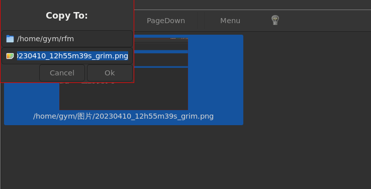

在rfm的基础上，我作了定制，使用参数-p,接收管道输入文件名，以大图标查看图片，选中文件按回车用IMV查看完整图片。比如命令：

`locate 菱锰|grep .jpg|rfm`


在config.def.h, config.h里配置使用IMV软件看图


如果希望选中图片回车打开每次都使用新的IMV窗口，而不是在同一个IMV窗口里切换图片，可以使用如下命令：

`locate 菱锰|grep .jpg|rfm & exit`


一些我自己常用的操作流程：比如截屏后，把图片复制或移动到相应文档目录，然后 git stage 这些图片和文本信息，再git commit。就可以先cd进入相应文档目录，让后通过find 或locate找到最近的截图文件，用rfm显示出来，再多选要复制的图片后，在rfm 里面使用文件上下文菜单完成到当前目录的复制，当要选择复制的图片数量稍多时，比字符终端输 cp命令方便

```
find ~ -cmin -5 2>/dev/null|grep png|rfm
```




当只需要当前目录下的文件时，可以用 `locate $(pwd)` 返回当前目录下所有文件的完整路径;可以建立一个alias,方便今后输入：

```
alias locatepwd='locate $(pwd)'
```

然后可以用如下命令选出当前目录下所有 .md结尾的文件，用rfm 展示并在根据MIME type 用相应应用打开：

```
 locatepwd|grep .md$|rfm
```

也可以用[其他方法获取文件完整路径](https://blog.csdn.net/yaxuan88521/article/details/128172956),比如：

```
ls|xargs readlink -f|rfm
ls|xargs realpath|rfm
```


多张图片git stage 操作也比较稍嫌麻烦，当然我可以用类似如下命令一次stage多个当天的图片文件：

```
ls *20230410*|xargs git stage 
```

但现在可以在rfm里多选多个文件，然后通过鼠标右键菜单选择Stage操作。

rfm 原来只实现了用icon_view显示内容，这里怎加了-l 参数，使用列表视图显示内容，类似 ls -l 的显示内容。也可以在rfm界面里面使用 MOD+l 组合键切换icon或list视图。MOD键默认定义为Win键，可以在config.h里重新定义为Alt或别的键


在rfm列表视图里，若想不用鼠标选中多个文件，可以按住ctrl键后用上下键移到到待选文件，按空格选中。但我用fcitx5拼音输入法，默认ctrl+space是开启/禁用输入法按键。我不知道如何更换gtk视图的快捷键，但可以通过fcitx5-configtool更改拼音输入法的快捷键解决冲突。


如果在多个tty分别启动了wayland和xorg显示服务，可以用如下命令决定rfm这样的gtk应用窗口显示在那里：

```
WAYLAND_DISPLAY=wayland-1 rfm
GDK_BACKEND=x11 rfm

```


Firefox 下载界面有个"open containning folder" 按钮，用文件管理器打开下载目录。我图形界面用DWL,没有KDE啥的设置默认文件管理器的功能。可以编辑 /usr/share/applications/mimeinfo.cache 文件，找到 inode/directory= 这一行，然后把 rfm.desktop 设置为等号后面第一项。我的rfm Makefile里面包含了rfm.desktop文件的安装。[参见](https://askubuntu.com/questions/267514/open-containing-folder-in-firefox-does-not-use-my-default-file-manager)


#一些TroubleShooting记录#

##显示调试信息##

```
export G_MESSAGES_DEBUG=rfm
#或者 export G_MESSAGES_DEBUG=all
```
对于 G_LOG_DOMAIN rfm, 我没有做进一步细分，如果需要过滤可以 grep, 比如需要看包含g_spawn 的调试输出：

```
G_MESSAGES_DEBUG=rfm rfm|grep g_spawn
```

参见：
https://blog.gtk.org/2017/05/04/logging-and-more/

##gentoo上gdk-pixbuf这个包及其USE flag ##

我在gentoo笔记本上.jpg文件图标无法生成：
```thumbnail null, GError code:3, GError msg:Couldn’t recognize the image file format for file “/home/guyuming/plant/IMG_20230513_145210.jpg”```
源于 gdk_pixbuf_new_from_file_at_scale 函数

网上搜不到答案，只提到有个 gdk-pixbuf-query-loaders 工具可以在shell里运行，但我gentoo上也没找到这个工具，估计没装，在寻找这个工具安装过程中发现有gdk-pixbuf这个USE flag. 

后来 `euse -i gdk-pixbuf` 发现有 x11-libs/gdk-pixbuf 这个包，包上有个jpeg USE flag没打开，打开后 .jpg文件就可以产生缩略图了。


-----------分割线下面是rfm原README内容--------------------


rfm - rods file manager
=======================

Introduction
------------
rfm is a basic filemanager for use with dwm (http://dwm.suckless.org/) on linux.
The aim of the project was:
   * flexible thumbnailing capabilities
   * file handling by mime type
   * use drag and drop for file operations
   * show status of mount points defined in fstab
   * small code base for easy maintanance.


Requirements
------------
Requires gtk3, at least 3.22. Tested on Arch linux (http://www.archlinux.org).
Works on xorg (tested on dwm) or wayland (tested on sway; DnD broken on weston).

Installation
------------
Edit config.h to suit your requirements.
It may also be neccessary to edit Makefile if some of the libraries can't be found. Then

   make clean
   make
	 
As root:
   make install

The installation part copies rfm to /usr/local/bin; this can
be done manually if required.

The default config.h assumes certain apps are available and requires the scripts in
scripts/ to be copied to /usr/local/bin:
cp scripts/* /usr/local/bin

Some scripts require bash. At a minimum, properties.sh may be useful.

If you use the default config.h, please check it to ensure you have the defined apps
installed! The filemanager does not use .desktop files in /usr/share/applications/,
although it could be configured that way using a script if required.

Configuration
-------------
All configuration is done in the config.h file, and the filer must be recompiled using
the supplied Makefile to implement the changes.

Run actions will be shown in the action menu (right-click) IN THE ORDER defined 
in config.h. Thus, Copy, Move and Delete are always the first three items in the menu.
The first defined run action for any mime type will become the default (double-click)
action for that file type.

*** The first three run actions *** defined in config.h MUST be for the Copy,
Move and Delete commands, in that order:

static const char *f_rm[]   = { "/bin/rm", "-r", "-f", NULL };
static const char *f_cp[]   = { "/bin/cp", "-p", "-R", "-f", NULL };
static const char *f_mv[]   = { "/bin/mv", "-f", NULL };

static RFM_RunActions run_actions[] = {
   /* name         mime root     mime sub type      argument          run options */
   { "Copy",       "*",          "*",               f_cp,             RFM_EXEC_INTERNAL },   
   { "Move",       "*",          "*",               f_mv,             RFM_EXEC_INTERNAL },   
   { "Delete",     "*",          "*",               f_rm,             RFM_EXEC_INTERNAL },
}

The argument is a pointer to an array containing the details of the command to run in linux execv() style; from
linux man page for execv: 
   "...an array of pointers to null-terminated strings that represent the argument list available to the
    new program. The first argument, by  convention,  should  point  to  the filename associated with
    the file being executed.  The array of pointers must be terminated by a null pointer."
The last column controls how the program should be run - see supplied config.h for more details.

The copy and move operations defined here are invoked from both the action menu AND for drag and drop.

This is the minimum requirement for run_actions, but can be extended for other mime types,
for examples and further instructions see the supplied config.h.


Running rfm
-----------

Usage: rfm [-c || -d <full path to directory> || -i || -v]

The default displayed directory is $HOME

All options are mutually exclusive:
	-c: open in current working directory rather than $HOME
	-d: open in given directory
	-i: identify object: right click on object shows mime type of file on stdout
	-v: show copyright and version information

The -i option may be useful when setting up config.h: the file command
doesn't always return the same type as gtk!

Using rfm
---------
There are two menus: right click on an object shows the action menu of commands defined in
config.h for the selected file's mime type; right click on the background shows a menu for
new file / new dir / copy path to cut buffer (not configurable).

Double click on a dir to enter it; double click on any other object to run the default action.

Single click selects an object: multiple objects can be selected via 'rubber band' or using
shift / ctrl keys.

Single click with mouse move on selected items starts drag and drop copy or move. Drag and drop is the
primary method for copying / moving files: the copy / move (rename) on the file menu only applies
to single objects selected. There is no clipboard support for filesystem objects.

Copy / Move / Delete Dialogue box with Cancel, No, Yes, All buttons:
Clicking 'Cancel' at ANY POINT will stop the WHOLE operation before any files are actually changed.
Click 'No' to exclude the named file from the operation.
Click 'Yes' to include the file in the operation (only useful for multiple files).
Click All at any point to delete all remaining files selected without further prompting.

Thumbnails
----------
GTK+ has built in imaging for many different file types; however, you can also define your own thumbnailer
for specific mime types in config.h. The first entry in RFM_Thumbnailers is for the internal GTK based
thumbnailer; this must be present. Additional thumbnailers may be defined as a user defined function: see
config.h for further details.

Tool bar
--------
There are 6 built-in toolbar functions:
Menu    - show the menu (same as right click)
Up      - next directory level up
Home    - show user's home directory
Stop    - stop current directory read / thumbnailing operation
Refresh - Left Click: Refresh mounts list / current view; Right Click: to refresh and toggle display order
Info    - Show running background tasks.

Tool bar buttons can be added using config.h. See config.def.h for further details.

NOTE: a right click on the refresh button will switch the sort mode from
      alphabetical order to file modified time order (latest files last) before refreshing.
      This is a toggle switch: right click again to restore the original order.

Keyboard Controls
-----------------
These are default gtk keys:

Arrow keys:       select item
Enter / space:    activate item (default action)
Shift+arrow keys: select multiple adjacent items
Ctrl+arrow keys:  select multiple items items with the space bar
Tab:              switch between the tool bar and the icon view

For toolbar: arrow keys to navigate, enter to select.
For menus:   arrow keys to navigate, enter to select, esc to close without selection.

Icon Themes
-----------
The filer falls back to showing default built-in icons taken from the Tango Desktop Project, or possibly other GTK
internal icons (these were supposed to be removed at some point by GTK developers).
You have two options to define the icon theme / font to use:

1. Use gtk-3 settings.ini (prefered method):

Create the file: ~/.config/gtk-3.0/settings.ini and add e.g.:
	--------------------------------------------------------
	[Settings]
	gtk-icon-theme-name = elementary
	# Use fc-list | sed 's,:.*,,' | sort to get font names
	gtk-font-name = Bitstream Vera Sans 10
	--------------------------------------------------------

This will cause rfm to use the elementary icon theme (recommended) with Bitstream Vera Sans 10 pt fonts;

NOTE: theme changes are not watched for in any running filer; A restart is required to free the old theme
      and apply the new.

2. Force the required theme:

This is not prefered, because other GTK+ apps may load other themes requiring more than one icon theme
to be cached in memory. It is best for all GTK+ apps to use a common theme. If you still want this then:
   
Edit config.h and add e.g.
	#define RFM_ICON_THEME "Tango"
   
This will force rfm to use the Tango icon theme, if installed.

Icon sizes are controlled by:
	#define RFM_TOOL_SIZE 22
	#define RFM_ICON_SIZE 48
	#define RFM_THUMBNAIL_SIZE 128

NOTE that all thumbnails are cached in ~/.cache/thumbnails/normal/ according to the freedesktop specification.
For the normal directory, the thumbnail size should not exceed 128x128 pixels. Changing RFM_THUMBNAIL_SIZE
will alter the generated thumbnail size and the displayed size. Therefore, RFM_THUMBNAIL_SIZE should
not exceed 128 to remain within the freedesktop specs. rfm will not complain if this is set greater than 128,
but other apps using the cache might!

Notes on XDG related stuff: untested since rfm 1.0
--------------------------------------------------

If you don't use dwm and require the filer to be registered with a desktop environment, or want to use
with xdg-open etc, you need to:

1. Create rfm.desktop in ~/.local/share/applications/
2. Edit and add contents:
		[Desktop Entry]
		Encoding=UTF-8
		Name=rfm
		GenericName=rods file manager
		Comment=Simple file manager for dwm
		Exec=rfm
		TryExec=rfm
		Icon=*** ADD an ICON here if required ***
		Terminal=false
		MultipleArgs=false
		Type=Application
		MimeType=inode/directory;
		Categories=Application;FileManager;
3. Create / edit defaults.list in ~/.local/share/applications/
4. Add inode/directory=rfm.desktop to the list, e.g.

[Default Applications]
application/pdf=mupdf.desktop
inode/directory=rfm.desktop

You can add the following to config.h in the approprate places to open an object
with the default XDG app:
static const char *xdg_open[]  = { "/usr/bin/xdg-open", NULL };
...
   { "xdg-open",        "*",     "*",  xdg_open,  RFM_EXEC_NONE }

This will cause xdg-open to appear in the action menu for every object.

Users of dwm might prefer to add:

   static const char *open_with[]  = { "/usr/local/bin/open_with_dmenu.sh", NULL };
   { "Open with...",    "*",     "*",  open_with,  RFM_EXEC_NONE },

as a catch all to use dmenu for opening files. The helper script open_with_dmenu.sh is included in the scripts dir.

License
-------
See LICENSE file for copyright and license details.

Summary Notes
-------------
1. All file operations are carried out using shell commands, defined in config.h. 
2. Regardless of run option, stdin is not available. Be sure to run non-interactive commands only,
   unless you run them inside a terminal, e.g. xterm [-hold] -e <command>.
3. If the output of external programs is to be displayed, the following points should be noted:
      * If pango markup is used, you need to escape any markup characters in filename etc, i.e. use
        something like sed 's/\&/\&amp\;/g; s/</\&lt\;/g; s/>/\&gt\;/g' to  replace & with &amp; < with &lt;
        and > with &gt;
      * Valid UTF-8 characters are required in any output.
      * If the number of output chars (stdin / stderr) to be displayed exceeds RFM_MX_MSGBOX_CHARS
        the output will always be shown in a scrollable text window regardless of the run option setting.

Limitations
-----------
All processes run in a single main thread. Unresponsive directories (e.g. slow or unstable network
shares) will cause the filer to 'hang' until they become available again.
Changes to files in the displayed directory result in a rescan of the entire directory contents. This may
result in slow operation if the directory contains a large number of files.


Acknowledgements / references
----------------------------
Author:                 Dr. Rodney Padgett <rod_padgett@hotmail.com>

dwm:                    https://dwm.suckless.org/
Arch Linux:             https://archlinux.org/
freedesktop:            https://www.freedesktop.org/wiki/Specifications/thumbnails/
stock-icons:            Tango Desktop Project: http://tango.freedesktop.org/Tango_Desktop_Project
elementary icon theme:  https://github.com/elementary/icons
guyuming:               Thanks for pointing out some errors in the code.
