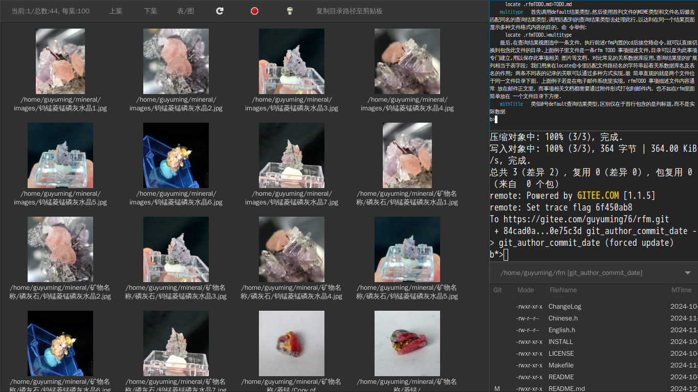
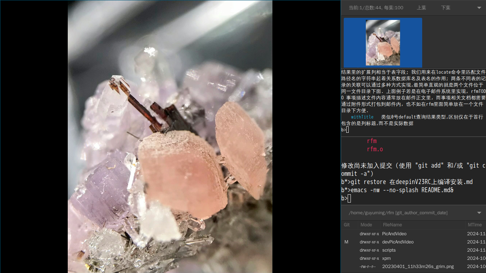
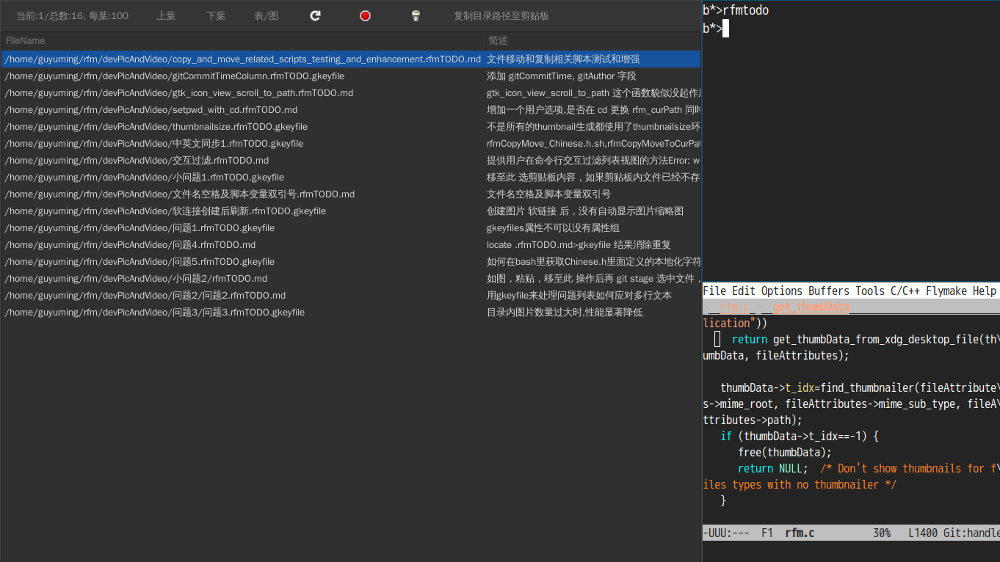
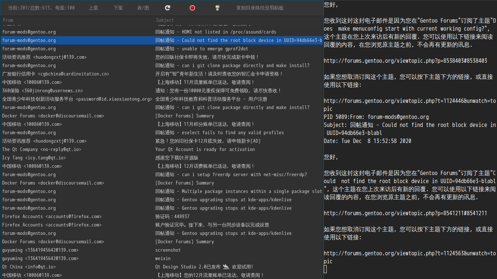

This is just a delayed partial mirror.

For latest update: please visit https://gitee.com/guyuming76/rfm

This read me is still in Chinese, I don't have enough time/motivation to keep English readme now. Anyway, there is English UI and help, which is kept in English.h file, you can view the help after launching with rfm.sh. And you can refer to https://github.com/padgettr/rfm , the project i forked

# installation #
after git clone

```
make
make install
```


# 视频链接 #
https://www.bilibili.com/video/BV1vM411d7pu/?share_source=copy_web&vd_source=69ac2f08a55f7029fc7026bcf6b55e11

# 一些截屏 #


# 已经有很多著名文件管理器了，比如Dolphin,Nautilus,ranger等，为啥还要rfm，有啥特点？ #

缩略图视图方便查看图片视频文件，列表视图方便查看文件元数据，在二者切换选中文件不变，方便对照; 为了保持代码简单，没有实现文件管理器常见的树形视图，但可以使用类似git ls-files这样的命令显示多层目录内容。

注重终端模拟器内的命令行交互，可使用Bash, nushell, python等多种命令操作选中文件. rfm舍弃了常见文件管理器的多种文件操作图形对话窗口，代之以在弹出终端模拟器内执行对话命令脚本，方便定制或以此为基础，开发使用文件系统作为数据存储的应用。

除了目录浏览，还支持文件查询结果浏览，并且文件查询结果还可以作为查询命令的输入进一步处理。

在列表视图，除了显示文件元数据，还可以显示文件查询命令输出的类似csv格式的数据，以及从文件中提取的键值对数据，方便开发以文件系统（而不是关系数据库）为存储的应用。

suckless 风格的应用，可以在config.h文件里做定制。

集成文件git状态显示。

...

启动 rfm 后默认会在命令窗口显示详细帮助信息，或在rfm命令窗口执行help命令

# 使用举例 #

## rfm用于管道右端 ##

接收管道输入的文件名列表，以大图标查看图片，选中文件按回车用IMV查看完整图片。比如命令：

`locate 菱锰|grep .jpg|rfm.sh`



这个是我拿到Rodney分享的rfm后做的第一个功能增强,因为我当时需要一个工具来查看locate 命令返回的图片. 我不是很确定别的文件管理器有没有类似功能,考虑到研究尝试linux下现有文件管理器也费时间,即使找到有功能的,代码又不一定易读,所以就直接在rfm上动手了. 这个功能实现后,很自然地就为rfm加上了列表视图,这个是几乎所有文件管理器都有的功能.

后来摸索出了在新的线程里使用readline读取用户输入,把命令操作和图形界面同步结合起来, 发觉可以尝试一些之前在windows上从未有过的操作体验。Nautilus及Dolphin貌似带终端模拟器,可以实现图形文件管理器和命令行的联动,我没用过,也不知道他是如何实现的,但带一个自己的Terminal组件在我看来似乎是一个劣势. 我的方案理论上就不挑终端模拟器，只是继承了启动rfm的Terminal的输入输出.



在IMV窗口按p键,当前图片文件名会显示在rfm的标准输出窗口,即启动rfm的虚拟终端命令行窗口.

如果希望选中图片回车打开每次都使用新的IMV窗口，而不是在同一个IMV窗口里切换图片，可以使用如下命令用exit关闭启动rfm的终端模拟器：

`locate 菱锰|grep .jpg|rfm.sh & exit`


有些截屏软件不提示图片保存路径，在截屏操作后，可以先在终端模拟器里cd进入需要保存截屏的文档目录，再通过如下find 或locate找到最近的截图文件，用rfm查询结果视图显示出来;在rfm命令输入窗口输入`cp `, 选择要复制的图片，按tab键将选中文件名补全到 cp 命令后面，输入 `.` 表示目的地址，回车即可完成复制:

```
find ~ -cmin -5 2>/dev/null|grep png|rfm.sh
```

接受相对路径文件名作为管道输入:
```
ls | rfm.sh
#有时ls会多列输出,要用参数 -w1 指明显示一列
ls -w1 |rfm.sh
```
可以用如下命令打开当前目录下(包含子目录)的文件:
```
find |rfm.sh -l
```

## 常用文件操作 ##

鼠标双击或回车进入子目录，使用工具栏上向上箭头按钮进入上层目录。还可以在rfm命令窗口使用rfm定义的cd命令在目录间导航, 在rfm命令窗口输入`help cd`查看帮助。

复制/移动文件，通常先选中源文件，然后使用上下文菜单，通常我习惯先复制文件名列表至剪贴板，然后在目标路径点工具栏按钮 粘贴/移至此。也可以在文件上下文菜单弹出的命令交互中直接输入目标路径; 或是通过在目标路径先直接点 粘贴/移至此 启动流程，而不是先选择源文件。


## git 相关 ##

多文件 git stage 操作：可以在rfm里参照git状态列多选文件，然后在命令窗口执行 `git stage `,注意命令结尾的空格，表示把选中文件作为参数追加在结尾。

使用git log获取每个文件最后提交信息的操作比较慢，所以默认不显示。可以用如下rfm内置命令显示相关列：
```
showcolumn gitCommitID,gitCommitAuthor,gitCommitDate,gitCommitMsg
```

git 仓库目录中,若包含子目录, 可以用下面命令查看目录内容:
```
git ls-files | rfm.sh -l
```

在git仓库目录,比如我自己用来保存矿物晶体标本图片的目录,要想看某个commit添加的图片,除了在列表视图按gitCommitMsg排序外,也可以在git log 获取到commitid 后,用下面命令来把文件列表输出到查询结果界面.注意当前目录需是git仓库根目录,因为结果文件路径是相对于git仓库根目录的:
```
git show --name-only --oneline 69e7addecc44ef518a84ce3b6684c03cc2cc081d>0
```

## 用作文件选择器(rfmFileChooser) ##

Firefox 下载界面有个"open containning folder" 按钮，用文件管理器打开下载目录。我图形界面用DWL,没有KDE啥的设置默认文件管理器的功能。可以编辑 /usr/share/applications/mimeinfo.cache 文件，找到 inode/directory= 这一行，然后把 rfm.desktop 设置为等号后面第一项。我的rfm Makefile里面包含了rfm.desktop文件的安装。[参见](https://askubuntu.com/questions/267514/open-containing-folder-in-firefox-does-not-use-my-default-file-manager)

最简单的用作文件选择器的方法展示：在弹出的rfm窗口选中文件，按q退出，则选中的文件路径会作为参数提供给ls命令， `ls $(rfm.sh -r)`;

rfm还可以用在诸如程序文件打开菜单里,返回选中的文件名列表. 在实现此功能前,我考虑过把rfm现有的视图,工具栏等图形界面元素包装成 gtk widget, 以便用户使用. 但后来觉得改动有些大, 就选择让用户通过启动单独rfm进程来使用. 
rfm加 -r 参数就可以在退出时通过命名管道返回选中文件名列表. 一开始想只在标准输出返回文件名, 但标准输出可能还会包含rfm运行时的其他输出内容, 客户端读取时需要排除,比较麻烦. 更重要的是, 文件选择器有时要和虚拟终端一起启动: `foot rfm -r`, 我不知道客户程序如何才能"隔着foot程序"读取rfm的标准输出, 就只能通过事先约定好的命名管道传递结果.
建立命名管道,启动rfm进程,读取返回值的过程稍嫌麻烦,我就添加了 rfmFileChooser_glist 和 rfmFileChooser 这两个函数, 前者需要用户引用 glib glist, 而后者不需要.

测试文件选择器,可以使用 test_rfmFileChooser 内置命令, 也可以 `gcc -g test_rfmFileChooser.c` 编译并运行.


# 使用rfm的一些场景 #

## rfm开发测试问题列表 ##
github, gitee 等自带的issue列表是和商业网站绑定的，如果有一天，你想换个地方host仓库，例如自己架设一个 gitolite 网站，原来的issue是带不走的。我在rfm代码仓库下面建了一个子仓库，用来保存文档，如开发测试中遇到的问题的截屏，同时用来展示rfm处理SearchResult的功能(参见rfm启动时显示的帮助)。rfm config.def.h里面定义了命令别名 rfmTODO, 在clone rfm代码仓库时使用--recurse-submodules参数，或者使用`git submodule update --init --recursive`命令把这个子仓库clone到本地，就可以在rfm里使用rfmTODO命令查看问题列表(你可能还需要运行sudo updatedb,因为rfmTODO使用了locate命令):

## https://gitee.com/guyuming76/mineral ##

## https://gitee.com/guyuming76/guyuming_garden ##

我最初设想的这个文件管理器的一个应用场景就是教学场景:
1.老师可以把要分享的课件,作业,试题放在自己的git仓库里;
2.每个学生fork老师的仓库;
3.学生clone自己的仓库到本地;
4.学生在本地完成作业后commit,push;
5.老师用脚本clone所有学生的仓库到本地,然后用脚本完成作业统计批改;

这个过程的操作一开始可能会比啥ClassIn之类附带的作业系统麻烦,但这个过程学生是真正地学会了一种主流计算机技能.而且随着师生对脚本编程技术的掌握,可以定制得越来越方便.
疫情期间上网课,我看娃就不停地上传下载作业.我问她一个问题:你的这些作业文件和自己硬盘本地内容及目录组织结构一致吗? 过几年你还能在ClassIn里找到自己当年的作业吗?你从小学开始的纸质作业我尽量都给你打包存储,电子作业如何管理?这个问题用git就好解决多了!
因为更多地利用了文件名和目录,就不必把很多内容放在一个office文档里,可以拆分成多个文本,图片文件,也就有机会让孩子接触使用最基础的应用工具解决问题,而不是只会依赖商业软件的傻瓜式操作. 比如作业常见的选择题, 类似我在 https://gitee.com/guyuming76/mineral 提到的"矿物属性" 文本文件和gkeyfile查询结果类型,可以每一个选择题单独一个文件,题干,选项都是属性.


## 查看Maildir目录下的邮件 ##
如下命令,通过config.h中定义的muview查询结果类型查看Maildir中邮件, 需要把locate 命令后的Maildir目录换成你自己系统上实际的目录:

```
locate 139INBOX/cur/>muview
#上面命令邮件不一定按时间排序,可以换成下面的:
cd /home/guyuming/Mail/139INBOX/cur
ls -1t>muview
```



使用mbsync同步139邮箱和maildir, 配置文件参见(scripts/.mbssyncrc),同步命令如下:
```
$mbsync -a -V
```

# 一些TroubleShooting记录以及其他备注 #

## 显示调试信息 ##

```
export G_MESSAGES_DEBUG=rfm
#或者 export G_MESSAGES_DEBUG=all
```
或在rfm命令窗口执行 `setenv G_MESSAGES_DEBUG` 查看相关帮助。

参见：
https://blog.gtk.org/2017/05/04/logging-and-more/

[调试gtk warning, critical 等 assertion 消息： G_DEBUG=fatal-warnings gdb ./my-program](https://developer-old.gnome.org/glib/stable/glib-Warnings-and-Assertions.html)


## gentoo上gdk-pixbuf这个包及其USE flag ##

我在gentoo笔记本上.jpg文件图标无法生成：
```thumbnail null, GError code:3, GError msg:Couldn’t recognize the image file format for file “/home/guyuming/plant/IMG_20230513_145210.jpg”```
源于 gdk_pixbuf_new_from_file_at_scale 函数

网上搜不到答案，只提到有个 gdk-pixbuf-query-loaders 工具可以在shell里运行，但我gentoo上也没找到这个工具，估计没装，在寻找这个工具安装过程中发现有gdk-pixbuf这个USE flag. 

后来 `euse -i gdk-pixbuf` 发现有 x11-libs/gdk-pixbuf 这个包，包上有个jpeg USE flag没打开，打开后 .jpg文件就可以产生缩略图了。

## [在deepinV23RC上编译安装需要的依赖](在deepinV23RC上编译安装.md)  ##

## 有时候，rfm会进入后台运行，可以用fg命令切换回前台正常运行 ##


## rfm窗口使用黑色主题 ##
编辑文件 /etc/gtk-3.0/settings.ini
或 `locate gtk-3.0/settings.ini` 找到其他配置文件
在settings组下面设置 gtk-application-prefer-dark-theme = 1

## 按键冲突 ##
在rfm列表视图里，若想不用鼠标选中多个文件，可以按住ctrl键后用上下键移到到待选文件，按空格选中。但我用fcitx5拼音输入法，默认ctrl+space是开启/禁用输入法按键。我不知道如何更换gtk视图的快捷键，但可以通过fcitx5-configtool更改拼音输入法的快捷键解决冲突。

## 指定显示服务 ##

如果在多个tty分别启动了wayland和xorg显示服务，可以用如下命令决定rfm这样的gtk应用窗口显示在那里：

```
WAYLAND_DISPLAY=wayland-1 rfm.sh
GDK_BACKEND=x11 rfm.sh

```


# 计划更改备忘 #

# 赞助和付费服务 #
本软件遵循GPL开源自由协议,可通过作者闲鱼店铺接受赞助和付费服务:

1.直接转账;

2.购买实物商品,如矿物晶体标本等个人闲置;

3.购买付费软件定制开发,咨询和培训服务;


